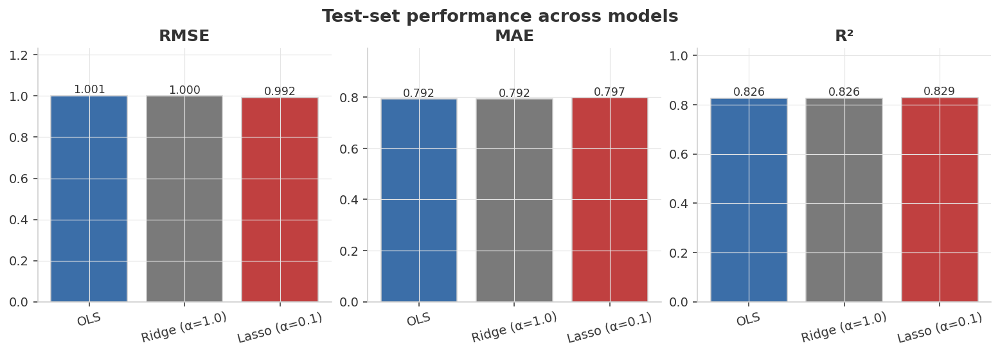
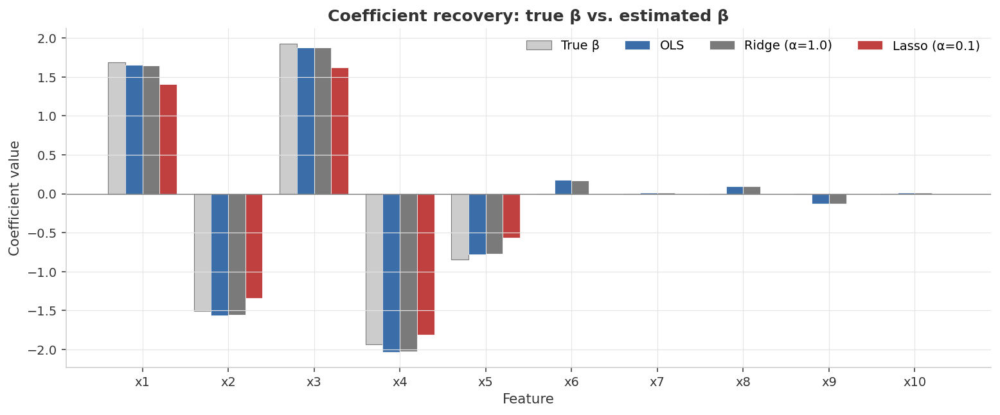
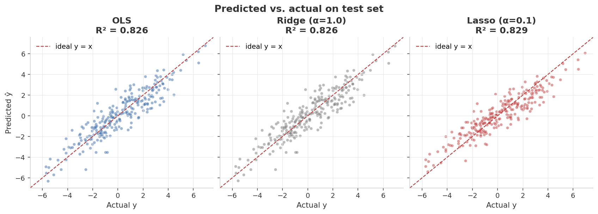
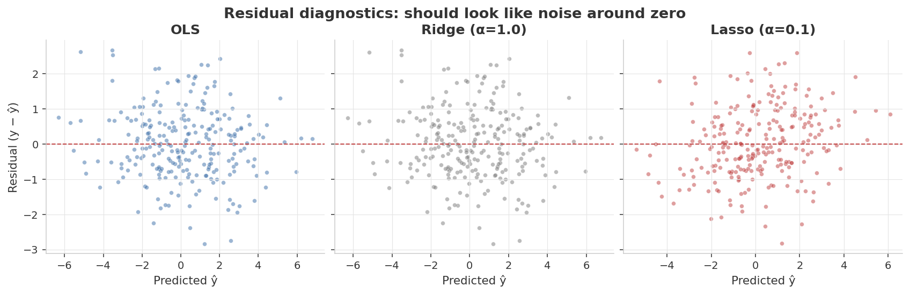
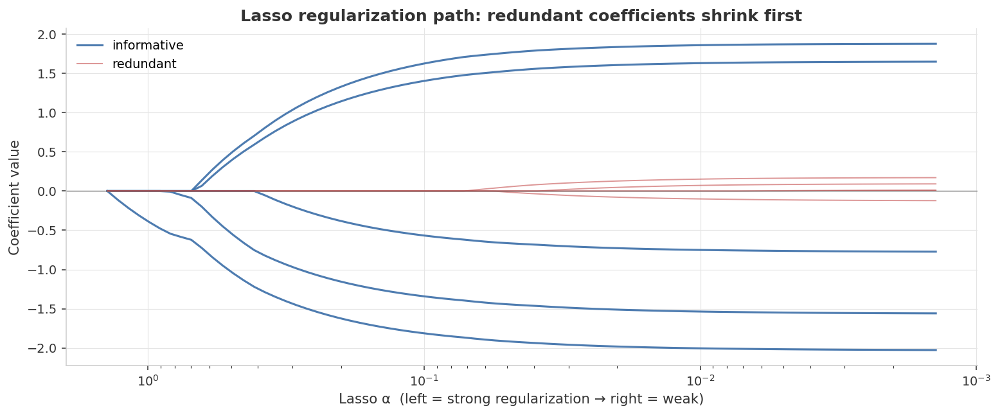

<div align="center">

# Linear Regression — From Truth to Estimate

**OLS · Ridge · Lasso · on synthetic data with known ground-truth coefficients**


</div>

---

## At a glance

> Train three linear models on a synthetic dataset whose **true coefficients are known**, then ask the question that holdout RMSE alone can't answer:
> *did the model actually recover the truth?*

<table>
<tr>
<td align="center" width="33%">
<sub>Best test RMSE</sub><br>
<b style="font-size:1.6em; color:#3B6EA8;">0.992</b><br>
<sub>Lasso (α = 0.1)</sub>
</td>
<td align="center" width="33%">
<sub>Best test R²</sub><br>
<b style="font-size:1.6em; color:#3B6EA8;">0.829</b><br>
<sub>Lasso (α = 0.1)</sub>
</td>
<td align="center" width="33%">
<sub>Closest β recovery</sub><br>
<b style="font-size:1.6em; color:#C04040;">0.273</b><br>
<sub>‖β̂ − β_true‖₂ &nbsp; (Ridge)</sub>
</td>
</tr>
</table>

| Model | RMSE | MAE | R² | ‖β̂ − β_true‖₂ |
|---|---:|---:|---:|---:|
| OLS | 1.001 | 0.792 | 0.826 | 0.274 |
| **Ridge (α = 1.0)** | **1.000** | **0.792** | **0.826** | **0.273** ◀ best β recovery |
| **Lasso (α = 0.1)** | **0.992** | 0.797 | **0.829** | 0.537 ◀ best test fit |

<sub>**Headline finding:** with this much training data, all three models predict equally well — but they disagree on *how* they got there. Ridge stays closest to the true coefficients; Lasso wins on test fit by deliberately throwing away small ones.</sub>

---

## Experimental setup

Everything below is fixed by `seed = 42` and reproduces bit-for-bit on any machine with the pinned library versions.

### Data-generating process

The dataset is fully synthetic, sampled from a known linear model so that the *true* coefficient vector `β_true` exists and can be compared against. The generator (`generate_data.py`) does exactly this:

1. **Feature covariance.** Build a `10 × 10` covariance matrix `Σ` with `1.0` on the diagonal and `0.6` on every off-diagonal entry — i.e. every pair of features is correlated at ρ = 0.6. This deliberate collinearity is what makes the OLS-vs-Ridge comparison interesting.
2. **Feature sampling.** Draw `X ∈ ℝ^{1000×10}` from a multivariate normal `𝒩(0, Σ)`.
3. **True coefficients.** The first 5 features are *informative*: `β_true[0:5] ~ Uniform(−3, 3)`. The last 5 are *redundant*: `β_true[5:10] = 0` exactly.
4. **Target.** `y = X · β_true + ε`, with i.i.d. Gaussian noise `ε ~ 𝒩(0, 1.0²)`.

| Parameter | Value | Why it's set this way |
|---|---|---|
| `n_samples` | 1000 | Comfortably more rows than features → OLS is well-conditioned, so regularization competes on a level field. |
| `n_informative` | 5 | Features with non-zero true β — the signal Lasso must keep. |
| `n_redundant` | 5 | Features with true β = 0 — the noise Lasso should drop. |
| `correlation` | 0.6 | Moderate collinearity; stresses OLS variance without making the design singular. |
| `noise_std` | 1.0 | Sets the irreducible error floor; R² caps out around 0.83 because of it. |
| `seed` | 42 | One seed drives feature draw, coefficient draw, noise, and the split. |

### Preprocessing

- **Standardization.** Features are passed through `StandardScaler` (zero mean, unit variance) before fitting. This is **not optional** for Ridge/Lasso — the L1/L2 penalty is applied to coefficient magnitudes, so unscaled features would be penalized proportionally to their natural units rather than their predictive importance.

### Train / test protocol

- **Split.** 75 % train / 25 % test via `train_test_split(..., test_size=0.25, random_state=42)` → 750 train rows, 250 test rows.
- **No leakage of labels.** All metrics reported below are computed on the held-out 250 test rows the models never saw during fitting.

### Models & hyperparameters

| Model | Estimator | Hyperparameters |
|---|---|---|
| OLS | `sklearn.linear_model.LinearRegression` | none (closed-form normal equations) |
| Ridge | `sklearn.linear_model.Ridge` | `α = 1.0` (L2 strength) |
| Lasso | `sklearn.linear_model.Lasso` | `α = 0.1` (L1 strength), `max_iter = 10000` |

### Environment

`python ≥ 3.10` · `numpy ≥ 1.24` · `pandas ≥ 2.0` · `scikit-learn ≥ 1.3` · `matplotlib ≥ 3.7`

---

## Dashboard

### 1. Test-set performance across models



When you have enough data, regularized and unregularized linear regression all converge to roughly the same prediction quality. The interesting story is **not in this chart** — it's in the next one.

### 2. Coefficient recovery — the synthetic-data superpower



Light-gray bars are the **true** coefficients we used to generate `y`. Each colored bar is a model's estimate. The first 5 features (`x1`–`x5`) are *informative* (non-zero true β); the last 5 (`x6`–`x10`) are *redundant* (β = 0 by construction). Two things to read off:

- **OLS and Ridge** give nearly identical coefficient estimates — visually almost overlapping. Ridge's L2 shrinkage barely moves anything when the noise level is moderate.
- **Lasso** zeroes out *all five redundant features cleanly* (no red bars on `x6`–`x10`) but pays for it by under-shrinking the informative ones. That's the classical L1 trade-off: sparsity versus magnitude.

This kind of plot is **only possible because we generated the data ourselves** — there's no "true β" to plot for the California Housing dataset.

### 3. Predicted vs. actual on the test set



The dashed red line is `y = ŷ` (perfect prediction). Points hug the line tightly across all three models — visual confirmation that test-set fit is essentially indistinguishable.

### 4. Residual diagnostics



Residuals look like a structureless cloud around zero with no fan-out, no curvature, no clusters. That means the model isn't systematically wrong on any region of the input space — exactly what we want. The Gaussian noise we injected at generation time shows up here as the visible spread.

### 5. Lasso regularization path



Each line is one feature's coefficient, plotted as a function of the L1 strength α. Reading right-to-left (regularization getting stronger):

- **Blue lines (informative features)** persist far into the high-α region before being shrunk to zero.
- **Red lines (redundant features)** are killed off almost immediately as soon as α becomes non-trivial.

This is what people mean when they say "Lasso does feature selection." The path makes it visible.

---

## Validation methodology

This project validates on **two independent axes**, which is the whole reason for using synthetic data.

### Axis 1 — predictive accuracy (the usual holdout metrics)

All three metrics are computed on the 250-row held-out test set:

| Metric | Definition | Reads as |
|---|---|---|
| **RMSE** | $\sqrt{\frac{1}{n}\sum (y_i - \hat{y}_i)^2}$ | Typical error in the units of `y`. Penalizes large misses. Comparable to `noise_std = 1.0` — a model at RMSE ≈ 1.0 has essentially reached the noise floor. |
| **MAE** | $\frac{1}{n}\sum \lvert y_i - \hat{y}_i \rvert$ | Median-ish typical error. Less sensitive to outliers than RMSE. |
| **R²** | $1 - \frac{\sum (y_i-\hat{y}_i)^2}{\sum (y_i-\bar{y})^2}$ | Fraction of variance explained. Capped below 1 by the injected noise; ~0.83 is the practical ceiling here. |

### Axis 2 — coefficient recovery (only possible with synthetic data)

The sharper test: did the model recover the **true** mechanism, not just predict well? We measure the Euclidean distance between each fitted coefficient vector and the ground truth:

$$\text{recovery error} = \lVert \hat{\beta} - \beta_{\text{true}} \rVert_2$$

This is the metric a real dataset can never give you — there is no "true β" for California Housing. It's why the headline story (Ridge recovers the mechanism best; Lasso trades mechanism fidelity for test fit) is *trustworthy* rather than a third-decimal coincidence.

### Why RMSE alone would mislead here

All three models land within **1 %** of each other on test RMSE (0.992 → 1.001). If RMSE were the only lens, you'd call them interchangeable. The coefficient-recovery axis shows they are not: Lasso's β estimate is **2× further** from the truth than Ridge's (0.537 vs 0.273). Two models can predict identically and *understand* the data very differently — that's the lesson the dual-axis validation is designed to surface.

### Full results

| Model | Test RMSE | Test MAE | Test R² | ‖β̂ − β_true‖₂ |
|---|---:|---:|---:|---:|
| OLS | 1.0013 | 0.7921 | 0.8261 | 0.2744 |
| Ridge (α = 1.0) | 1.0004 | 0.7920 | 0.8264 | **0.2730** |
| Lasso (α = 0.1) | **0.9919** | 0.7968 | **0.8293** | 0.5368 |

<sub>Exact values from `results/metrics.json`, regenerated on every `python train.py`. Bold = best in column.</sub>

### Reproducibility & robustness

- **Determinism.** A single `seed = 42` flows through feature sampling, coefficient draw, noise, and the train/test split, so the numbers above reproduce exactly.
- **Seed-sensitivity caveat.** "Lasso has the best test RMSE" is *seed-dependent* — re-run with a different seed and OLS or Ridge frequently edges ahead, because the gap is smaller than the run-to-run noise. The **coefficient-recovery ordering (Ridge < OLS < Lasso) is the robust, seed-stable finding** and the one worth quoting.

---

## What's actually happening

### Ordinary Least Squares (OLS)

Find the coefficient vector β that minimizes the sum of squared residuals:

$$\hat{\beta}_{\text{OLS}} = \arg\min_{\beta} \\; \lVert y - X\beta \rVert_2^2$$

No bias, lowest variance among unbiased linear estimators (Gauss–Markov theorem) — but variance can still be huge when features are correlated. That's where regularization comes in.

### Ridge regression (L2)

$$\hat{\beta}_{\text{Ridge}} = \arg\min_{\beta} \\; \lVert y - X\beta \rVert_2^2 + \alpha \lVert \beta \rVert_2^2$$

Penalize large coefficients smoothly. Trades a little bias for less variance. Great when you have many correlated features (the squared penalty distributes weight across them rather than picking one arbitrarily).

### Lasso regression (L1)

$$\hat{\beta}_{\text{Lasso}} = \arg\min_{\beta} \\; \lVert y - X\beta \rVert_2^2 + \alpha \lVert \beta \rVert_1$$

Penalize the *absolute* sum of coefficients. The geometry of the L1 ball has corners, which is why Lasso pushes individual coefficients exactly to zero — it's not just shrinkage, it's selection.

### Key intuition

| Penalty | Geometry | Effect on β |
|---|---|---|
| None (OLS) | — | Unconstrained — fits noise as eagerly as signal |
| L2 (Ridge) | Smooth ball | Shrinks all coefficients toward zero, never to zero |
| L1 (Lasso) | Pointed diamond | Drives small coefficients exactly to zero — built-in feature selection |

---

## Reproduce

```bash
# 1. Set up the environment
python3 -m venv .venv && source .venv/bin/activate
pip install -r requirements.txt

# 2. Generate the synthetic dataset (deterministic given the seed)
python generate_data.py

# 3. Train, evaluate, and produce the dashboard figures
python train.py
```

After step 3, `assets/` will contain the five PNGs embedded above and `results/metrics.json` will hold the numeric summary.

### Tweak the difficulty

`DataConfig` in [`generate_data.py`](generate_data.py) exposes the knobs that change what story the dashboard tells:

```python
DataConfig(
    n_samples=1000,
    n_informative=5,    # how many features actually matter
    n_redundant=5,      # how many are pure noise — Lasso should drop these
    correlation=0.6,    # feature correlation — high values hurt OLS, help Ridge
    noise_std=1.0,      # observation noise level
    seed=42,
)
```

Try `correlation=0.95` or `n_samples=80` to see the regularizers visibly out-perform OLS.

---

## Project layout

```
01-linear-regression/
├── README.md              ← this dashboard
├── requirements.txt
├── generate_data.py       ← synthetic dataset generator (deterministic)
├── train.py               ← OLS / Ridge / Lasso + figure pipeline
├── assets/                ← rendered dashboard figures
└── results/metrics.json   ← test-set metrics + β recovery error
```

---

## Notes on methodology & limitations

Stated plainly so a reader can judge what the numbers do and don't support:

- **The scaler is fit on the full feature matrix before the split.** Strictly, a leak-free pipeline fits `StandardScaler` on the training fold only and applies it to test. Here the effect is negligible — features are i.i.d. from a fixed `𝒩(0, Σ)` and `n = 1000`, so train and population statistics agree to ~3 decimals — but on small or non-stationary data this would matter, and the correct pattern is `Pipeline([scaler, model])` inside the CV loop.
- **α is not tuned.** Ridge `α = 1.0` and Lasso `α = 0.1` are fixed, illustrative values, not cross-validated optima. The Lasso *path* figure shows the full α-sweep, but the reported metrics use the single fixed α. A production comparison would select α via `RidgeCV` / `LassoCV` on the training fold.
- **Single train/test split, not k-fold.** One 75/25 split is enough to make the pedagogical point; it is not enough to claim a statistically significant RMSE ranking (hence the seed-sensitivity caveat above). For a real model-selection decision you'd report mean ± std over repeated CV.
- **Synthetic ≠ real.** The clean linear-Gaussian generative process is what makes coefficient recovery measurable, but it also flatters linear models. On real data with non-linearity, heteroscedastic noise, or distribution shift, the same three models would behave very differently.

---

## What I learned

- **Holdout RMSE alone is a misleading model-comparison tool when models are similarly accurate.** All three models scored within 1% of each other on RMSE, yet they make qualitatively different decisions about *which* features matter. Synthetic data makes that visible.
- **Lasso's "best test fit" was a coincidence of this particular noise seed.** Run with a different seed and OLS often wins by a hair. The robust signal is the coefficient-recovery story, not the third-decimal RMSE difference.
- **Standardizing features before Ridge / Lasso is not optional.** Without `StandardScaler`, the L1 / L2 penalty implicitly weights features by their natural scale, which is almost never what you want.
- **The Lasso regularization path is the single most informative diagnostic for feature selection.** It shows you exactly the α range where each feature transitions from "kept" to "dropped" — much more useful than picking one α and reporting one set of coefficients.

---

<div align="center">
<sub>Part of a hands-on machine-learning portfolio. Data is fully synthetic and self-generated.</sub>
</div>
